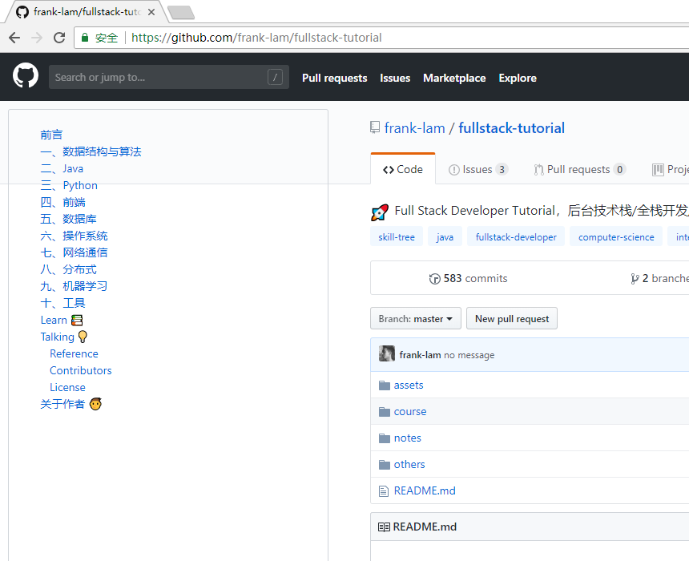

# GitHub-Markdown-Toc

## About

This is a chrome extension that supports parsing articles on GitHub and generating a sidebar directory for indexing of article titles.

> 这是一款 chrome 扩展，支持对 GitHub 上的文章进行解析，生成侧边栏目录，方便进行文章标题进行索引。

**like this**

**or like this**

## How to use

使用说明...

## Contributors

 

## Update

`2018/12/04`：v0.0.1 software is born