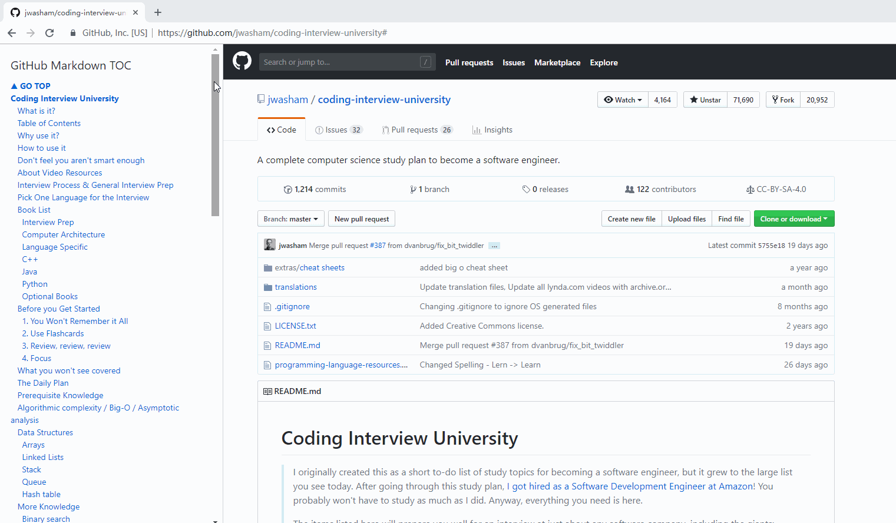
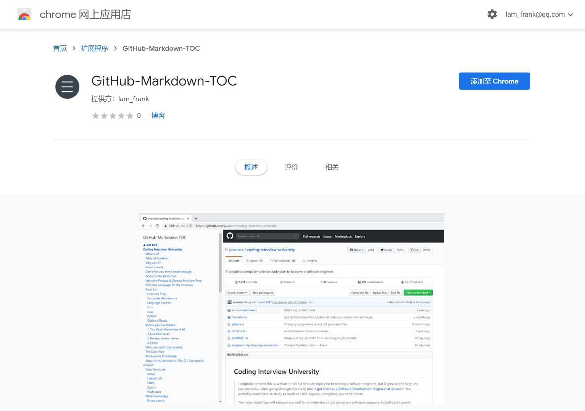

# GitHub-Markdown-TOC

## About

This is a chrome extension that supports parsing articles on GitHub and generating a sidebar directory for indexing of article titles.

> 这是一款 chrome 扩展，支持对 GitHub 上的文章进行解析，生成侧边栏文章标题目录。为 GitHub  而生的，文章标题目录索引扩展。

**like the rendering graphics below, this must make you very excited !**

## How to use

Currently available on the Chrome Market, click on the link to install : [Chrome Extension：GitHub-Markdown-TOC](https://chrome.google.com/webstore/detail/github-markdown-toc/hjjnbcjiekmpmkbogjkpchdblioffihb?hl=zh-CN)

**Support browser**: chrome browser, can also run in all chrome kernel browsers

> 目前已在 Chrome 市场上架，点击链接前往安装 [Chrome Extension：GitHub-Markdown-TOC](https://chrome.google.com/webstore/detail/github-markdown-toc/hjjnbcjiekmpmkbogjkpchdblioffihb?hl=zh-CN)
>

> **支持浏览器**：chrome浏览器，还可以运行在所有 webkit 内核的国产浏览器，比如 360 极速浏览器、360 安全浏览器、搜狗浏览器、QQ 浏览器等等

## Suggestion about us

Leave your experience feeling below

> 在下面可以留下你的体验感受哦

https://github.com/fullstack-tutorial/github-markdown-toc/issues/6

## Contributors

This is a partner of open source contributions, and interested friends are welcome to join the open source team. You can contact me by email, `frank_lin@whu.edu.cn`

> 这是开源贡献的小伙伴们，欢迎感兴趣朋友加入开源小组。可以通过邮箱联系我，frank_lin@whu.edu.cn

 

## Update

- 2018-12-04 : version 0.0.1
  - features
    - software is born
- 2018-12-08 : version 0.0.2
  - features
    - 侧边栏显示，不遮挡正文内容
    - 拖动自适应效果
- 2018-12-25
  - chrome 市场上架

