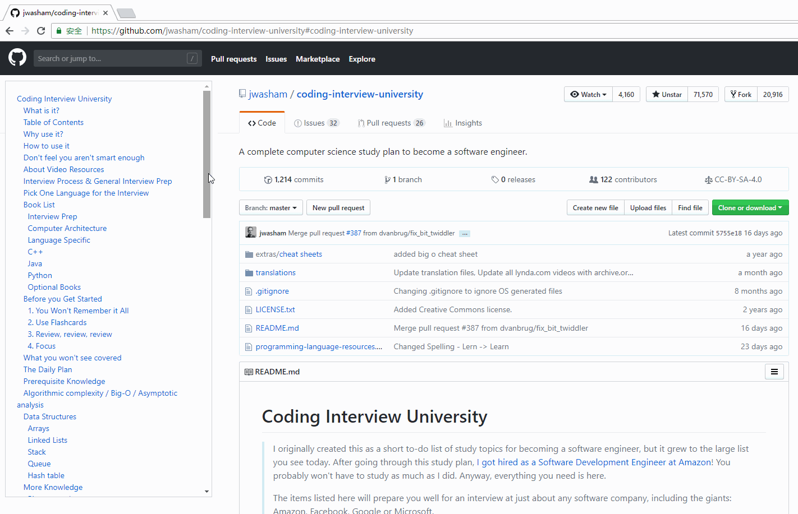

# GitHub-Markdown-TOC

## About

This is a chrome extension that supports parsing articles on GitHub and generating a sidebar directory for indexing of article titles.

> 这是一款 chrome 扩展，支持对 GitHub 上的文章进行解析，生成侧边栏目录，为 GitHub  而生的，文章标题目录索引扩展。

**like the rendering graphics below, this must make you very excited !**

## How to use

由于目前插件暂未上传至插件市场，需要手动下载。

1. 下载本仓库根目录文件 `markdown-toc-code.crx`，[点击下载](https://github.com/fullstack-tutorial/github-markdown-toc/blob/master/markdown-toc-code.crx?raw=true)
2. 直接将 `crx` 扩展文件拖动到 chrome 任意位置，添加即可安装（下载后浏览器直接打开也可安装）
3. 打开任意一个 GitHub 仓库，即可预览左侧目录

## Contributors

 

## Update

- 2018-12-04 : version 0.0.1
  - features
    - software is born
- 2018-12-08 : version 0.0.2
  - features
    - 侧边栏显示，不遮挡正文内容
    - 拖动自适应效果

